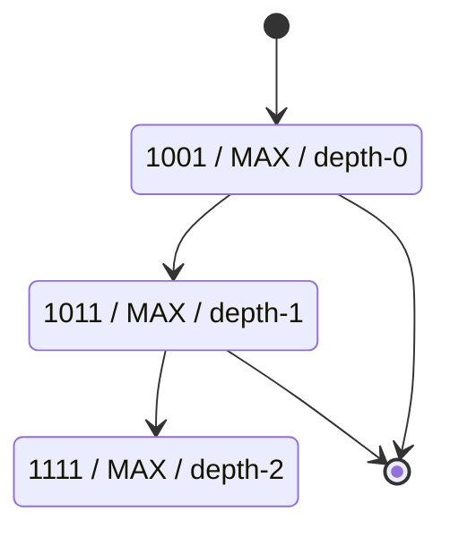
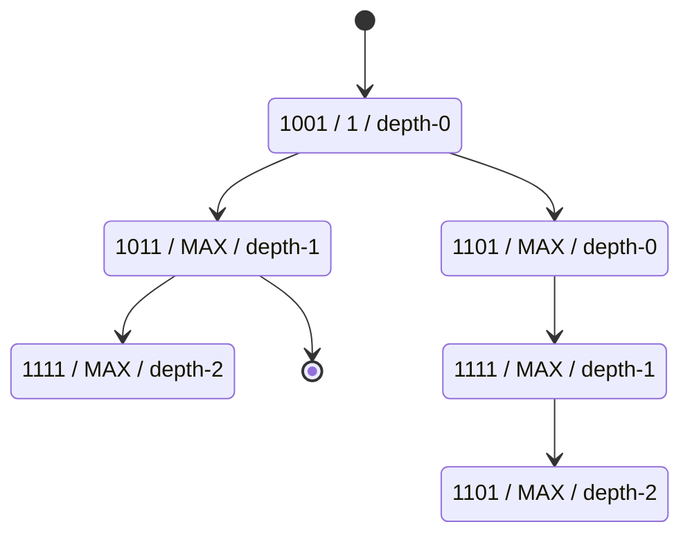
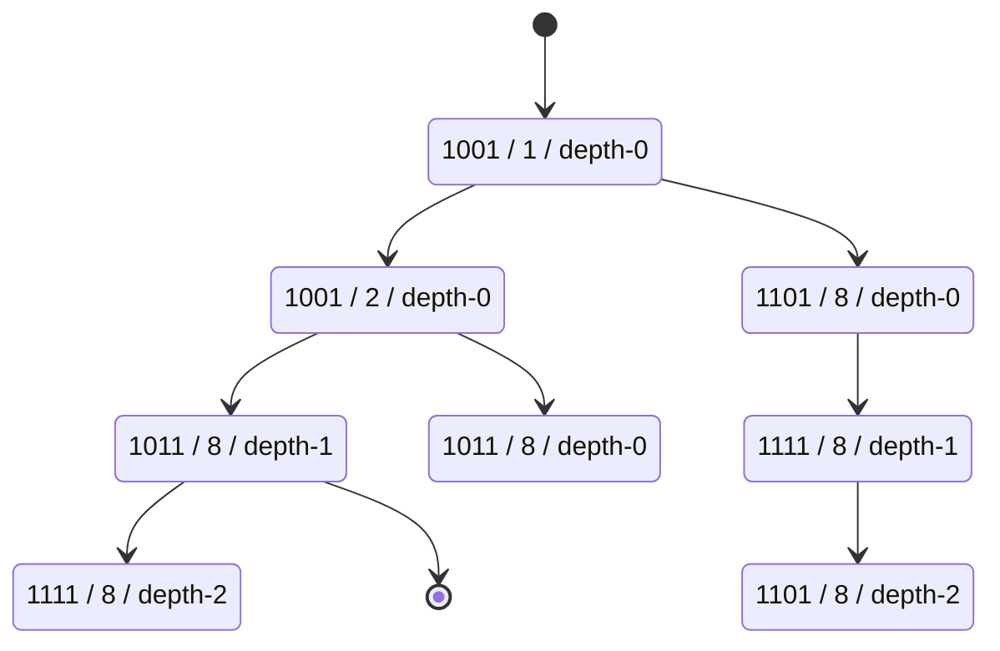

# Trie rs

A (probably forever WIP) of a rust implementation of Height Optimized Tries (HOT)
https://dbis-informatik.uibk.ac.at/sites/default/files/2022-04/binna_tods_2022.pdf

Current implementation is a just a patricia for learning purpose

# Byte trie
 
This describe evolution of the trie during insertion. It is helpful so I don't have
to re-understand all the code every time I come back to this project.

It operates on bits so that it can be binary, there can be at maximum 2 child: 0 or 1

> Format of box is:
> byte stored | offset | depth
> offset is the bit idx at which there is a difference (so we have children spanning from there)
> Depth is the byte idx (because we operate on random sized byte array (because we want
to store a string))

## Algo

Trie after inserting:

`1001 1011 1111`

if offset is MAX, it means that there are no right child.

------------

Stored:
`1001 1011 1111`

Inserting:
`1101 1111 1101`

first node is modified:
- offset is added
- right child is created

node1 xor 1101 = 0100
offset = 1

------------

Stored:
`1001 1011 1111`
`1101 1111 1101`

Inserting:
`1011 0101 1001`

first node is already split at a lower offset so we go to left child. Left can be split
because old offset (MAX) is bigger than the newer offset: 2.

1001 xor 1011 = 0010
offset = 2

