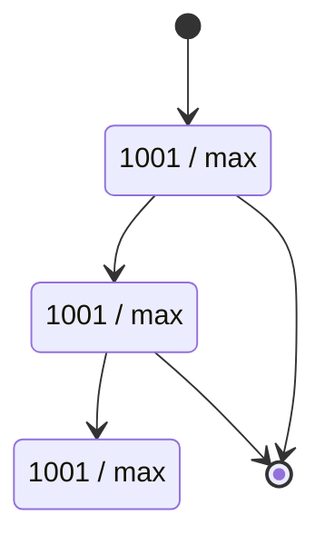
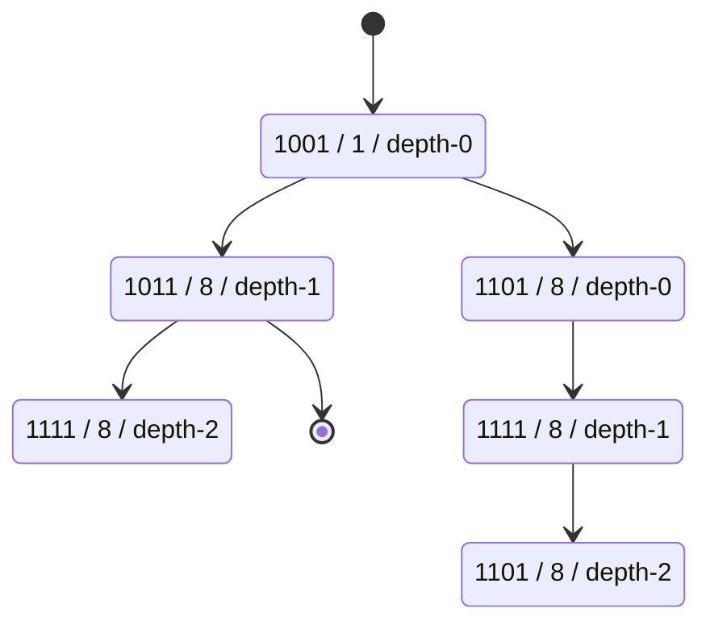
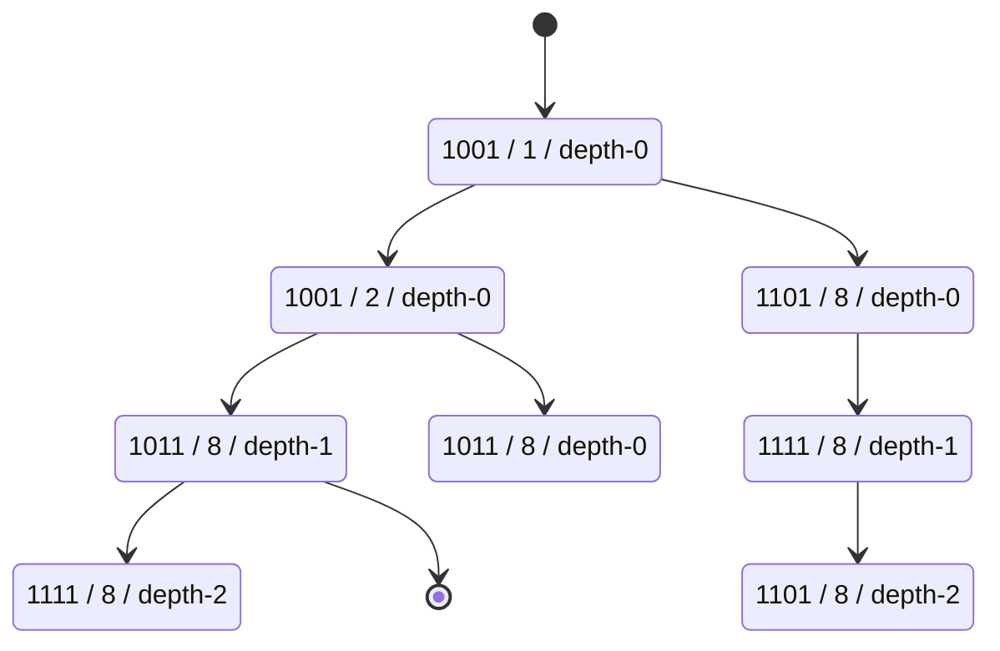

1001 1011 1111

1101 1111 1101

node1 xor 1101 = 0100
offset = 1

------------

1001 1011 1111

1101 1111 1101

1011 0101 1001

Attention node1 -> node2 how to change depth?

1001 xor 1011 = 0010
offset = 2

